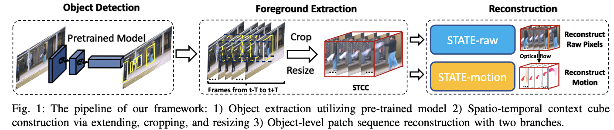

# Making Reconstruction-based Method Great Again for Video Anomaly Detection（ICDM 2022）


<div align="left">
    <a></a>
    <a></a>
</div>

 [arXiv](https://arxiv.org/abs/2301.12048) | [Paper](https://ieeexplore.ieee.org/stamp/stamp.jsp?tp=&arnumber=10027694) | Primary contact: [Yizhou Wang](mailto:wyzjack990122@gmail.com)

<div align="center">
  
</div>


## Abstract

Anomaly detection in videos is a significant yet challenging problem. Previous approaches based on deep neural networks employ either reconstruction-based or prediction-based approaches. Nevertheless, existing reconstruction-based methods 1) rely on old-fashioned convolutional autoencoders and are poor at modeling temporal dependency; 2) are prone to overfit the training samples, leading to indistinguishable reconstruction errors of normal and abnormal frames during the inference phase. To address such issues, firstly, we get inspiration from transformer and propose Spatio-Temporal Auto-Trans-Encoder, dubbed as STATE, as a new autoencoder model for enhanced consecutive frame reconstruction. Our STATE is equipped with a specifically designed learnable convolutional attention module for efficient temporal learning and reasoning. Secondly, we put forward a novel reconstruction-based input perturbation technique during testing to further differentiate anomalous frames. With the same perturbation magnitude, the testing reconstruction error of the normal frames lowers more than that of the abnormal frames, which contributes to mitigating the overfitting problem of reconstruction. Owing to the high relevance of the frame abnormality and the objects in the frame, we conduct object-level reconstruction using both the raw frame and the corresponding optical flow patches. Finally, the anomaly score is designed based on the combination of the raw and motion reconstruction errors using perturbed inputs. Extensive experiments on benchmark video anomaly detection datasets demonstrate that our approach outperforms previous reconstruction-based methods by a notable margin, and achieves state-of-the-art anomaly detection performance consistently.


## Usage

### Prepare data

Follow the instructions in [code of VEC](https://github.com/yuguangnudt/VEC_VAD) to download and organize Avenue and ShanghaiTech datasets.

### Environment setup

* python 3.6
* PyTorch 1.1.0 (0.3.0 for calculating optical flow)
* torchvision 0.3.0
* cuda 9.0.176
* cudnn 7.0.5
* mmcv 0.2.14 (might use `pip install mmcv==0.2.14` to install old version)
* [mmdetection](https://github.com/open-mmlab/mmdetection/tree/v1.0rc0) 1.0rc0 (might use `git clone -b v1.0rc0 https://github.com/open-mmlab/mmdetection.git` to clone old version)
* numpy 1.17.2
* scikit-learn 0.21.3

For the main training and testing process, the conda environment ``vad.yaml`` is provided.

```bash
conda env create -f vad.yaml
```


### Run the experiments

#### 1. Calculate optical flow

(1) Follow the [instructions](https://github.com/vt-vl-lab/flownet2.pytorch) to install FlowNet2, then download the pretrained model  [flownet2](https://drive.google.com/file/d/1hF8vS6YeHkx3j2pfCeQqqZGwA_PJq_Da/view?usp=sharing), and move the downloaded model `FlowNet2_checkpoint.pth.tar` into `./FlowNet2_src/pretrained` (create a folder named pretrained).

(2) Run `calc_img_inputs.py` (in PyTorch 0.3.0): `python calc_img_inputs.py`. This will generate a new folder named `optical_flow` containing the optical flow of the different datasets. The `optical_flow` folder has basically the same directory structure as the raw_datasets folder.

#### 2. Get pretrained object detector to generate bounding boxes

Follow the [instructions](https://github.com/open-mmlab/mmdetection/tree/v1.0rc0) to install mmdet (might use `git clone -b v1.0rc0 https://github.com/open-mmlab/mmdetection.git` to clone old version of mmdetection). Then download the pretrained object detector [Cascade R-CNN](https://s3.ap-northeast-2.amazonaws.com/open-mmlab/mmdetection/models/cascade_rcnn_r101_fpn_1x_20181129-d64ebac7.pth), and move it to `fore_det/obj_det_checkpoints` (create a folder named obj_det_checkpoints).


#### 3. Reproduce the results
The model checkpoints and some saved training statistics to use are provided in this [Dropbox Link](https://www.dropbox.com/sh/u96kxqy8w6zx22p/AABWqupd5uE8rHEQKwom-7tCa?dl=0)

#### Avenue
To train, run the following command

```bash
python train.py -d avenue -l 3 -n_l 3 -e 20
``` 
To test, run the following command

```bash
python test.py -d avenue -l 3 -n_l 3 -e 20 -w_r 0.3 -w_o 1 -ep 0.002

```

#### ShanghaiTech
To train, run the following command

```bash
python train.py -d ShanghaiTech -l 3 -n_l 5 -e 20
``` 
To test, run the following command

```bash
python test.py -d ShanghaiTech -l 3 -n_l 5 -e 20 -w_r 1 -w_o 1 -ep 0.005

```

## Acknowledgments
In this code we heavily rely on the [code of VEC](https://github.com/yuguangnudt/VEC_VAD). In the STATE architecture part code we heavily rely on the code of [ConvTransformer](https://arxiv.org/pdf/2011.10185.pdf) kindly provided by [Zhouyong Liu](https://dblp.org/pid/166/4117.html) via email. The README file format is heavily based on the GitHub repos of my senior colleague [Huan Wang](https://github.com/MingSun-Tse) and [Xu Ma](https://github.com/ma-xu). Great thanks to them! We also greatly thank the anonymous ICDM'22 reviewers for the constructive comments to help us improve the paper. 


## BibTeX

```BibTeX
@INPROCEEDINGS{10027694,
  author={Wang, Yizhou and Qin, Can and Bai, Yue and Xu, Yi and Ma, Xu and Fu, Yun},
  booktitle={2022 IEEE International Conference on Data Mining (ICDM)}, 
  title={Making Reconstruction-based Method Great Again for Video Anomaly Detection}, 
  year={2022},
  volume={},
  number={},
  pages={1215-1220},
  doi={10.1109/ICDM54844.2022.00157}
}

```
